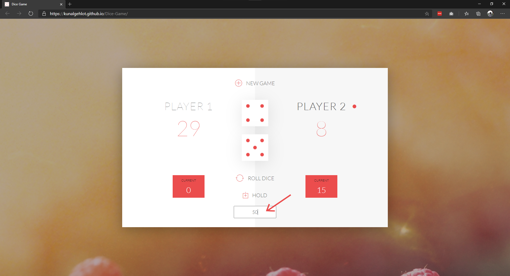
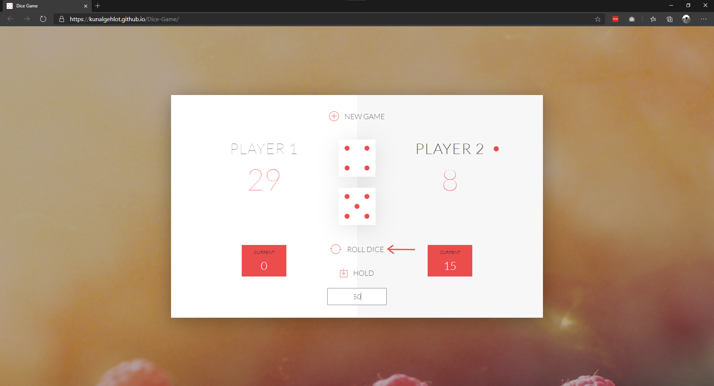

# Welcome to Dice Game 🎲

A simple game built on basic HTML, CSS and JS.

# How to Play ❓

Learn to play this very easy game 🎮!

## 1. Enter a Final Winning Score 🏆

## 2. Player rolls dice 🎲

In each role, the total score of the two dice is stored in curent score. If the player lands two six on the dice, the score resets to zero and the turn is passed to the next player..

## 3. Save the cuurent score 💾

Click Hold to add the current score to the final score. The first player to reach the final score wins!

## 4. New Game 🕹

Click on New game to start a new game.

